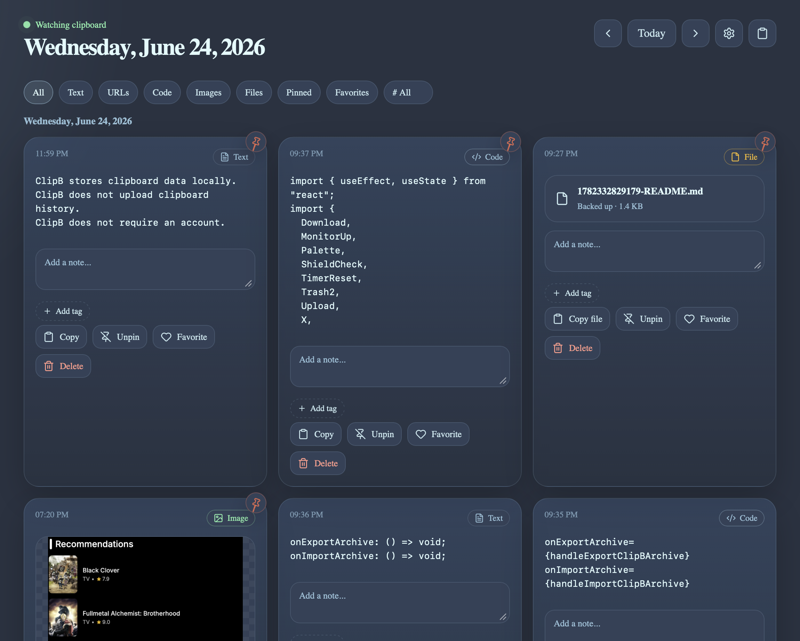
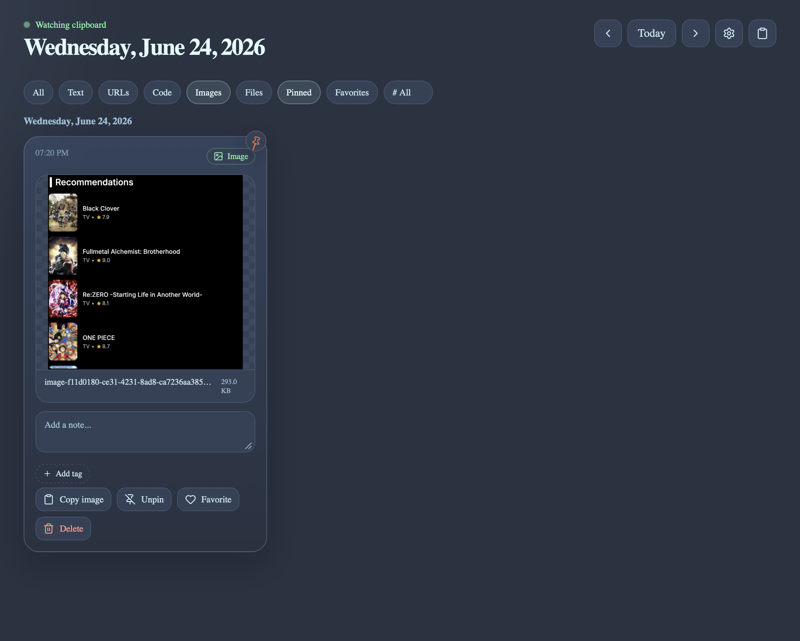
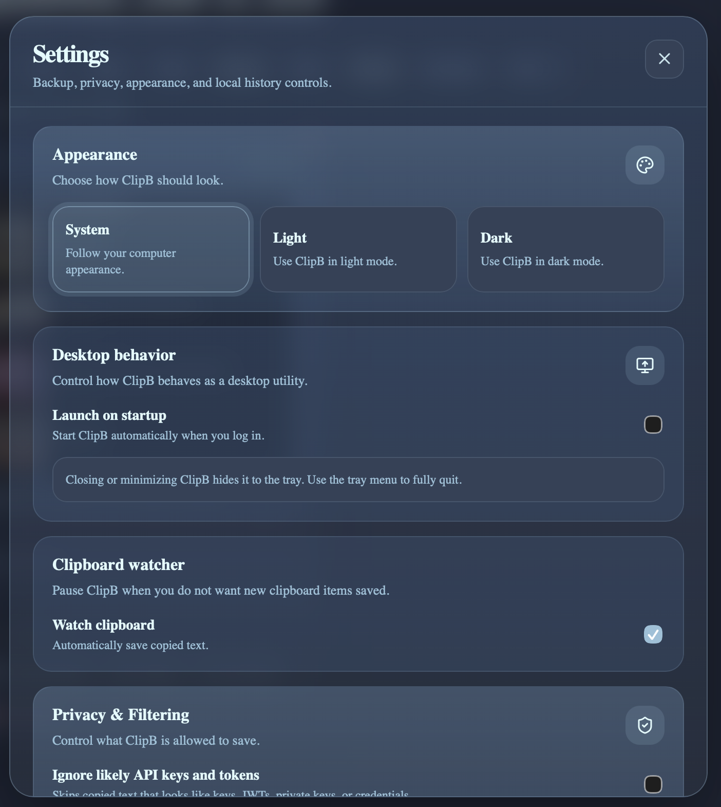
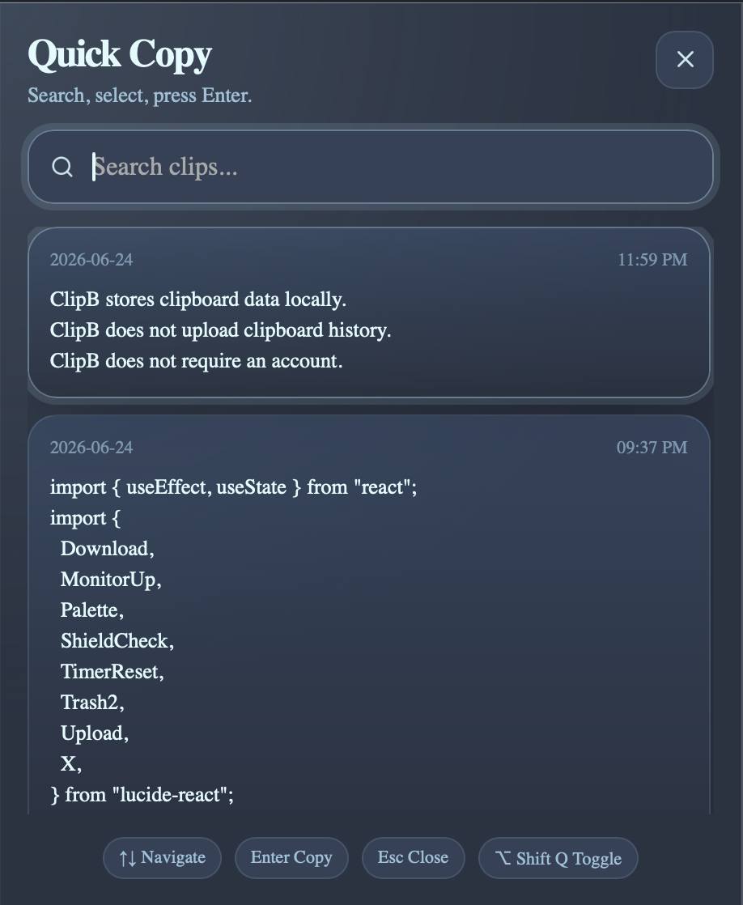
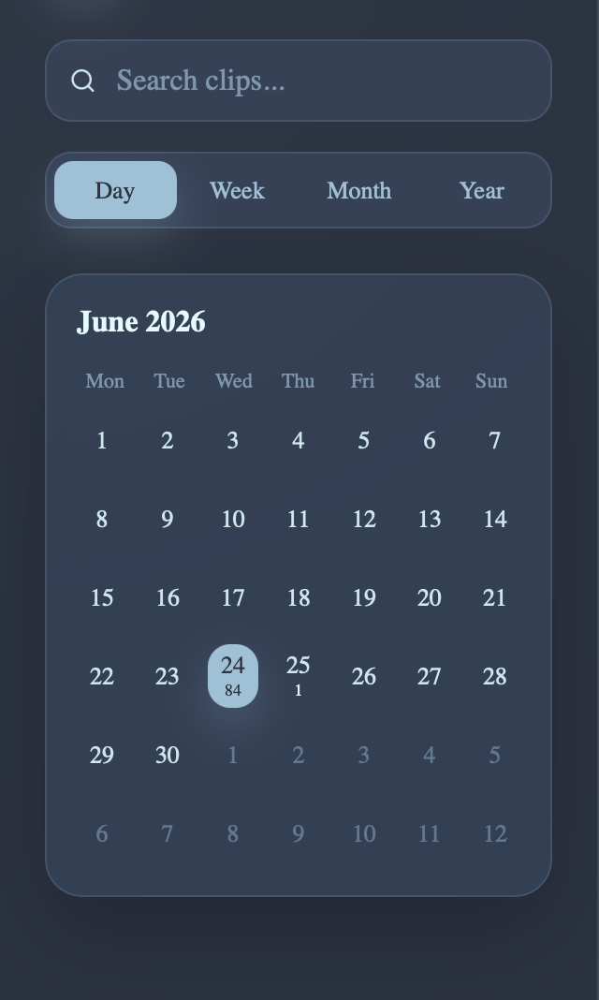

# ClipB

**ClipB** is a local-first desktop clipboard manager built with **Tauri**, **React**, **TypeScript**, and **SQLite**.

It saves clipboard history locally and organizes clips into a clean timeline with day, week, month, and year views. ClipB supports copied text, links, code snippets, screenshots, copied image files, copied file paths, optional local file backups, tags, notes, favorites, pinned clips, privacy filters, and portable backup archives.

ClipB is designed to be private, lightweight, fast, and fully local by default.

---

## Overview

Most clipboard managers show copied items as one long list. ClipB takes a more timeline-focused approach.

Copied items are organized by time, making it easier to answer questions like:

- What did I copy earlier today?
- What link did I copy last week?
- What file did I copy during a project session?
- What screenshot did I save yesterday?
- What code snippet did I copy for this feature?
- What did I copy on a specific day?

ClipB gives your clipboard memory without forcing cloud sync, accounts, or external storage.

---

## Current Features

- Local clipboard history
- Text clipboard tracking
- Image clipboard support
- Screenshot support
- Copied image file support on macOS Finder copy
- Copied non-image file path support
- Optional copied file backup
- Local asset storage for images and backed-up files
- Asset preview cards
- Calendar-style sidebar
- Day, week, month, and year views
- Search clipboard history
- Copy saved clips back to the clipboard
- Pin important clips
- Favorite clips
- Add manual notes to clips
- Add tags to clips
- Filter by content type
- Filter by pinned clips
- Filter by favorite clips
- Filter by tags
- Automatic URL detection
- Automatic code snippet detection
- Delete individual clips
- Clear all clips from settings
- Pause/resume clipboard watching
- Private mode
- Temporary pause timer
- Sensitive text detection
- Ignore likely passwords
- Ignore likely API keys/tokens
- Ignored apps list
- Active app detection for ignored apps
- Block clips copied from ignored apps
- Minimum clip length setting
- Maximum clip length setting
- Auto-delete old clips after a selected period
- Option to protect pinned clips from auto-delete
- System tray icon
- Run in background
- Global shortcut to open ClipB
- Quick-copy popup window
- Keyboard navigation in quick-copy window
- Launch on startup option
- Theme mode: system, light, dark
- JSON export/import for text history
- `.clipb` archive export/import for rich clipboard backups
- Local SQLite database storage
- Responsive desktop UI

---

## Screenshots

### Timeline View



### Rich Clipboard Support



### Settings and Privacy



### Quick Copy Window



### Calendar Sidebar



## Tech Stack

| Area                     | Technology                         |
| ------------------------ | ---------------------------------- |
| Desktop runtime          | Tauri                              |
| Frontend                 | React                              |
| Language                 | TypeScript                         |
| Styling                  | CSS                                |
| Local database           | SQLite                             |
| Clipboard access         | Tauri clipboard plugin             |
| Native copied file paths | Rust clipboard file integration    |
| File export/import       | Tauri dialog + file system plugins |
| Archive format           | `.clipb` ZIP-style archive         |
| Icons                    | Lucide React                       |

---

## Why Tauri?

ClipB is a background-style desktop utility, so it should be lightweight, fast, and private.

Tauri is a strong fit because:

- It creates smaller desktop apps compared to Electron.
- It uses the system webview instead of bundling a full Chromium runtime.
- It gives access to native desktop APIs through plugins and Rust commands.
- It has a stronger default security model.
- It works well with React and TypeScript.
- It is a good fit for local-first desktop utilities.

---

## Why SQLite Instead of JSON for Storage?

ClipB uses SQLite for internal storage because clipboard history grows over time.

SQLite is better for:

- Searching clips
- Filtering by date
- Filtering by content type
- Filtering by tags
- Sorting clips
- Deleting old clips
- Pinning clips
- Favoriting clips
- Storing notes
- Managing clip metadata
- Avoiding one huge JSON file
- Keeping the app fast as the history grows

JSON is still useful for simple text-only backup/export/import, but it is not the main app database.

The storage strategy is:

```txt
SQLite = internal app storage
JSON = simple text-only backup/import
.clipb = full rich clipboard backup/import
```

---

## Rich Clipboard Storage

ClipB does not store large images or backed-up files directly inside SQLite.

Instead:

```txt
SQLite = metadata
App data folder = assets
```

Example:

```txt
ClipB app data/
├── clipb.db
└── assets/
    ├── image-abc123.png
    ├── screenshot-def456.webp
    └── files/
        └── copied-document.pdf
```

SQLite stores metadata such as:

```txt
content
content_hash
content_type
category
note
asset_path
asset_name
asset_size
asset_mime
created_at
updated_at
is_pinned
is_favorite
```

This keeps the database lightweight and makes it easier to manage images, file previews, backups, and archive export/import.

---

## Supported Clip Types

ClipB currently supports:

| Type          | Description                                                         |
| ------------- | ------------------------------------------------------------------- |
| `text/plain`  | Normal copied text                                                  |
| `image/png`   | Copied image or screenshot                                          |
| `image/jpeg`  | Copied image file                                                   |
| `image/webp`  | Copied image file or optimized preview                              |
| `image/gif`   | Copied GIF file                                                     |
| `file/path`   | A copied file or folder path without backing up the actual file     |
| `file/backup` | A copied file that has been copied into ClipB’s local assets folder |

---

## Export and Import

ClipB supports two backup formats:

### JSON Backup

JSON export/import is kept as a simple text-history backup format.

It is useful for:

- Simple text-only backups
- Lightweight migration
- Debugging
- Future compatibility

Example:

```json
{
  "app": "ClipB",
  "formatVersion": 1,
  "exportedAt": 1760000000000,
  "clips": [
    {
      "type": "text/plain",
      "content": "Example copied text",
      "createdAt": 1760000000000,
      "updatedAt": 1760000000000,
      "isPinned": false
    }
  ]
}
```

### `.clipb` Archive

`.clipb` is the rich backup format for full ClipB history.

A `.clipb` file is a ZIP-style archive with a custom extension:

```txt
clipb-backup.clipb
├── manifest.json
├── clips.json
├── tags.json
├── clip_tags.json
└── assets/
    ├── image-001.png
    ├── screenshot-002.webp
    └── copied-file-001.pdf
```

The `.clipb` archive preserves:

- Text clips
- Image clips
- File path clips
- Backed-up file clips
- Notes
- Favorites
- Pinned state
- Tags
- Clip/tag relationships
- Image assets
- Backed-up file assets

Path-only file clips remain path-only. ClipB does not copy original path-only files into the archive unless they were already backed up into ClipB assets.

---

## Local-First Philosophy

ClipB is designed to be local-first.

That means:

- No account required
- No cloud sync by default
- No external server required
- Clipboard data stays on the user’s device
- Export/import is controlled by the user
- The app works offline
- Rich clipboard assets are stored locally
- Backed-up copied files stay inside the local ClipB app data folder

This is important because clipboard history can contain sensitive information such as:

- Passwords
- API keys
- Private messages
- Personal notes
- Bank details
- Work documents
- Authentication tokens
- Screenshots
- Copied files

Because of this, privacy and user control are core parts of the product.

---

## Project Structure

```txt
clipb/
├── src/
│   ├── components/
│   │   ├── AssetImage.tsx
│   │   ├── ClipCard.tsx
│   │   ├── ClipTags.tsx
│   │   ├── EmptyState.tsx
│   │   ├── QuickCopyWindow.tsx
│   │   ├── SettingsModal.tsx
│   │   ├── Sidebar.tsx
│   │   └── Toast.tsx
│   │
│   ├── hooks/
│   │   └── useClipboardWatcher.ts
│   │
│   ├── lib/
│   │   ├── activeApp.ts
│   │   ├── assets.ts
│   │   ├── backup.ts
│   │   ├── clipbArchive.ts
│   │   ├── clipDetection.ts
│   │   ├── dates.ts
│   │   ├── db.ts
│   │   ├── desktop.ts
│   │   ├── fileClipboard.ts
│   │   ├── hash.ts
│   │   ├── imageClipboard.ts
│   │   ├── imageFileImport.ts
│   │   ├── nativeClipboardFiles.ts
│   │   ├── privacy.ts
│   │   └── privacyPatterns.ts
│   │
│   ├── App.tsx
│   ├── main.tsx
│   ├── types.ts
│   └── index.css
│
├── src-tauri/
│   ├── capabilities/
│   │   └── default.json
│   ├── src/
│   │   └── lib.rs
│   ├── Cargo.toml
│   └── tauri.conf.json
│
├── package.json
├── README.md
└── .gitignore
```

---

## Development Setup

Install dependencies:

```bash
pnpm install
```

Run the app in development mode:

```bash
pnpm tauri dev
```

Build the desktop app:

```bash
pnpm tauri build
```

---

## Recommended `.gitignore`

Make sure these files are ignored:

```gitignore
# Dependencies
node_modules

# Frontend build output
dist
build
.vite

# Tauri build output
src-tauri/target

# Local environment files
.env
.env.local

# Local database files
*.db
*.db-shm
*.db-wal

# Logs
*.log
npm-debug.log*
pnpm-debug.log*
yarn-debug.log*

# OS files
.DS_Store
Thumbs.db

# IDE
.vscode/*
!.vscode/extensions.json
.idea
```

---

## Milestones

### v0.1 — Initial MVP

- [x] Create Tauri desktop app
- [x] Set up React + TypeScript frontend
- [x] Add SQLite database
- [x] Save copied text locally
- [x] Prevent immediate duplicate clipboard saves
- [x] Display clipboard history as cards
- [x] Add calendar sidebar
- [x] Add day view
- [x] Add week view
- [x] Add month view
- [x] Add year view
- [x] Add search
- [x] Add copy-back button
- [x] Add delete clip button
- [x] Add pin/unpin feature
- [x] Make layout responsive
- [x] Fix small-window calendar spacing

### v0.2 — Backup and Safety

- [x] Add settings modal
- [x] Add pause/resume clipboard watching
- [x] Add JSON export
- [x] Add JSON import
- [x] Add clear all clips
- [x] Add clear-history warning
- [x] Add auto-delete retention setting
- [x] Add protect pinned clips setting
- [x] Add theme mode

### v0.3 — Desktop Utility Upgrade

- [x] Add system tray icon
- [x] Keep app running in background
- [x] Add global shortcut to open ClipB
- [x] Add launch on startup option
- [x] Add minimize to tray
- [x] Add quick-copy popup window
- [x] Add keyboard navigation
- [x] Add keyboard scrolling in quick-copy window

### v0.4 — Privacy and Filtering

- [x] Add sensitive text detection
- [x] Ignore likely passwords
- [x] Ignore likely API keys/tokens
- [x] Add ignored apps list
- [x] Add active app detection for ignored apps
- [x] Block clips copied from ignored apps
- [x] Add minimum clip length setting
- [x] Add maximum clip length setting
- [x] Add private mode
- [x] Add temporary pause timer
- [x] Add toast feedback
- [x] Split privacy token patterns into dedicated module

### v0.5 — Better Organization

- [x] Add tags
- [x] Add favorite clips
- [x] Add clip categories
- [x] Add manual notes
- [x] Add URL detection
- [x] Add code snippet detection
- [x] Add filter by pinned clips
- [x] Add filter by favorite clips
- [x] Add filter by content type
- [x] Add filter by tag

### v0.6 — Rich Clipboard Support

- [x] Add asset-aware database fields
- [x] Add local asset folder helper
- [x] Add asset cleanup when deleting clips
- [x] Add image clipboard support
- [x] Add copied image file support on macOS Finder copy
- [x] Add copied non-image file path support
- [x] Add optional copied file backup
- [x] Add `.clipb` archive export
- [x] Add `.clipb` archive import
- [x] Add asset preview cards
- [x] Copy image clips back as images
- [x] Copy file clips back as files

### v1.0 — Public Release

- [x] Add app icon
- [ ] Add installer builds
- [ ] Add Windows build
- [ ] Add macOS build
- [ ] Add Linux build
- [x] Add release notes
- [x] Add privacy policy
- [ ] Add landing page
- [x] Add screenshots/GIF demo
- [ ] Add GitHub releases
- [ ] Add signed builds if needed

---

### macOS security note

This build is currently unsigned and not notarized. macOS may show a warning when opening the app. This will be improved in a future signed release.

---

## Product Principles

ClipB will stay:

- Fast
- Local-first
- Private
- Simple
- Useful without an account
- Easy to export from
- Safe for sensitive clipboard content
- Transparent about what it saves
- Careful with files and assets

---

## Future Ideas

Possible future features:

- Cloud sync as an optional feature
- End-to-end encrypted sync
- Mobile companion app
- Browser extension
- OCR for copied images
- AI-powered clipboard search
- Smart summaries of copied research
- Workspaces/projects
- Temporary clipboard sessions
- Clipboard analytics
- File/folder restore actions
- Manage tags section in Settings
- Cross-device encrypted backup

Cloud sync will not be added until the local-first app is stable and privacy controls are strong.

---

## Commit Naming

Recommended commit names:

```bash
git commit -m "Initial ClipB MVP"
git commit -m "Add JSON backup and history settings"
git commit -m "Add tray and global shortcut"
git commit -m "Add privacy filters"
git commit -m "Add clip organization features"
git commit -m "Add image clipboard support"
git commit -m "Add native macOS copied image support"
git commit -m "Add copied file path support"
git commit -m "Add optional copied file backups"
git commit -m "Add ClipB archive import and export"
```

---

## License

ClipB is licensed under the **GNU Affero General Public License v3.0 or later**.

SPDX identifier:

```txt
AGPL-3.0-or-later
```

This means ClipB is free and open-source software. You may use, study, share, and modify it under the terms of the AGPL. If you distribute modified versions, or run modified versions as a network service, you must make the corresponding source code available under the same license.

See See [`LICENSE.md`](./LICENSE.md) for the full license text.

---

## Status

ClipB has completed its local-first MVP, desktop utility features, privacy controls, organization features, and rich clipboard support.

The current focus is preparing for a public release by polishing the UI, testing reliability, adding app icons, building installers, writing release notes, and creating a simple landing page.
